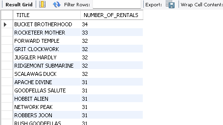

# Maven_Movies_Rental_Analysis

## 📌 Project Overview

This project centers on analyzing the MAVENMOVIES database to uncover actionable insights that can drive better decision-making in marketing, customer engagement, and inventory control. SQL is the primary tool used to perform exploratory data analysis (EDA), study the database schema, and solve key business problems.

---

## 🎯 Project Objectives

### 🛒 Customer Insights

- 📌 Retrieve customer information (names, emails) to support personalized marketing initiatives.

- 📊 Study rental patterns to boost customer retention and satisfaction.

### 🎮 Movie Collection Optimization

- 🛆 Assess rental stock and classify movies by rental prices and availability.

- 🔍 Recommend new movie acquisitions based on demand, popularity, and rental frequency.

### 💰 Revenue Growth

- 📈 Investigate pricing models and rental trends to identify high-margin opportunities.

- 🎥 Pinpoint top-performing categories and ratings to increase profitability.

### ⚙️ Operational Improvements

- 📌 Monitor inventory status to ensure efficient stock management.

- 📉 Detect gaps in movie availability and optimize restocking strategies.

 --

 
## 🛠️ Tools & Technologies

- *SQL* – For querying, transforming, and analyzing data

- *MAVENMOVIES Database* – Source of rental and customer data

## 📊 Key Outcomes & Insights

- 📢 Smarter marketing campaigns through customer segmentation and behavior analysis.
- 🎬 Stronger inventory management with demand-driven stocking.
- 💵 Higher revenue streams from optimized pricing and trending rentals.
- 📌 Better operational flow with structured tracking of movie assets.

---

# Movies Rental Data Queries

This repository contains SQL queries and corresponding visualizations for analyzing the Movies Rental dataset.

## Queries and Visualizations

### 1. Customer Information for Marketing Team
Retrieve customer first name, last name, and email ID.

### 2.Count movies with a rental rate of $0.99.

### 3.Show rental rate and number of movies in each category.

### Find the rating with the most films. 

### Find which rating is most common in each store.

### List films with title, category, and language.

### Count how many times each movie was rented.

### Show top 10 films by revenue.

### Find the customer who spent the most.

### Find which store earned the most revenue.

### Show revenue by time series (over time).

### Count rentals per month.

### List customers who rented at least 30 times.

### Get payments from the first 100 customers (by ID).

### Get payments over $5 from those same customers after Jan 1, 2006.

### Get payments from those 100 customers + all payments over $5 from anyone.

### List films with Behind the Scenes feature.

### Show unique ratings and number of movies in each.

### Count titles by rental duration.

### Show rating, movie count, length, and rental duration comparison.

### Group films by replacement cost → show count, avg, min, max rental rate.

### List customers with fewer than 15 rentals total.

### List films with title, length, and rental rate → sort by longest first.

### Categorize movies by length.

### Categorize movies for different age groups/demographics.

### List customer names + show which store they belong to + active/inactive.

### List all films in inventory with title, description, store_id, and inventory_id.

### Show actor name and how many movies they acted in.

### List film titles with number of actors in each.

### List all actors with films they appear in.

### List films (title + description) in Store 2 inventory.

### List all staff and advisors with a column showing their role.

